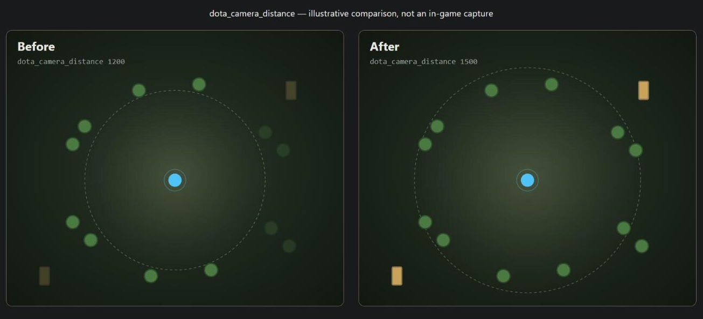

# dota2-camera-distance

A tool that patches Dota 2's `client.dll` to raise the default camera zoom distance, re-locating the target bytes on every run so it keeps working across game updates.

[](https://github.com/vladatman/dota2-camera-distance/releases/latest)
[](LICENSE)
[](https://github.com/vladatman/dota2-camera-distance/actions/workflows/tests.yml)



## Disclaimer

Editing files inside your Dota 2 installation technically violates Valve's terms of service. The risk of a ban is **not zero** — this tool is not "safe" and nobody can guarantee it won't be flagged. Use it at your own risk. It does not touch anything outside `client.dll` (no memory injection, no network traffic, no other files), and every write is preceded by an automatic backup, but that only protects your files, not your account standing.

## Quick start

**Option 1 — download the exe**

Grab the latest `camera_distance.exe` from [Releases](https://github.com/vladatman/dota2-camera-distance/releases/latest) and run it. No Python required.

**Option 2 — run from source**

Requires Python 3.10+, no third-party dependencies.

```
python camera_distance.py
```

Either way, on first run it will locate `client.dll` automatically, ask for your desired camera distance (with a resolution-based suggestion), patch it, and tell you how to confirm it in-game.

## Usage

```
camera_distance.exe [--dll PATH] [--distance N] [--restore | --diagnose]
                     [--launch] [--yes] [--candidate N]
```

| Flag | What it does |
|---|---|
| `--dll PATH` | Use this `client.dll` instead of auto-detecting it via Steam |
| `--distance N` | Set the camera distance directly (1000–2500), skipping the prompt |
| `--restore` | Revert `client.dll` to the `.bak` backup |
| `--diagnose` | Print a full report of what was found — never writes anything |
| `--launch` | Apply your last saved distance, then launch Dota 2 (`steam://rungameid/570`) |
| `--yes` / `-y` | Never prompt; abort instead of asking (for scripted/non-interactive use) |
| `--candidate N` | Pick candidate #N when multiple were found, combined with `--yes` |

Examples:

```
camera_distance.exe --distance 1500 --yes
camera_distance.exe --diagnose
camera_distance.exe --restore
camera_distance.exe --launch
```

### Point your Dota shortcut at it

Run `camera_distance.exe --launch` once to save a distance, then edit your Dota 2 shortcut's target to point at `camera_distance.exe --launch` instead of launching Steam directly. Every launch will silently re-apply your saved distance (searching for the constant fresh each time) and then start the game.

## How to check it worked

In Dota 2, open the developer console (enable it first via the launch option `-console` if you haven't) and type:

```
dota_camera_distance
```

It should print your new value.

## After a Dota update

Just run the tool again (or use `--launch`, which does this automatically). It re-locates the constant from scratch every time — it never relies on a remembered offset — so it keeps working as long as the same general code pattern exists in the new `client.dll`. If it doesn't, `--diagnose` will tell you exactly why (and please open an issue with its output).

## How it works

Dota's binary doesn't store `1200.0` (the stock default) as a labeled constant — it's just a 4-byte float sitting in `.rdata`, referenced indirectly by the camera code. The tool finds it by following the same reference chain the compiler generated:

1. Find the null-terminated string `dota_camera_distance` (the cvar's name) in the file, and convert its file offset to a relative virtual address (RVA) using the PE section table.
2. Scan the code for a `lea reg, [rip+disp32]` instruction whose computed target lands exactly on that string's RVA. This is the code that registers the cvar.
3. In a small window of bytes around that instruction, look for a RIP-relative SSE load (`movups`/`movss`/etc.) — the instruction that loads the camera-distance float into a register.
4. Read the 4 bytes at that load's target address. If it's `1200.0` (or another plausible previously-patched value), that's the constant. Only those 4 bytes get overwritten.

There are several *other* unrelated occurrences of the `1200.0` byte pattern elsewhere in the file (embedded as immediate values in unrelated instructions) — the tool never does a raw scan for the float value itself; only this specific reference chain counts. See `camera_distance.py` for the full implementation — it's plain, dependency-free Python and short enough to read before you run it.

## Manual fallback (HxD)

If you'd rather verify or patch by hand:

1. Run `camera_distance.exe --diagnose`.
2. Note the "resolved constant offset" it prints (a file offset, e.g. `0x3f2a73c`).
3. Open `client.dll` in [HxD](https://mh-nexus.de/en/hxd/), jump to that offset (Ctrl+G).
4. Replace the 4 bytes there with your desired distance encoded as a little-endian 32-bit float. (You can compute the bytes with `python -c "import struct; print(struct.pack('<f', 1500.0).hex())"`.)

## FAQ

**"Could not find the camera distance constant"** — Dota's binary layout may have changed enough that the reference chain no longer matches. Run `--diagnose`, open an issue, and attach its output.

**The game won't start after patching** — run `camera_distance.exe --restore` to revert to the automatic backup, then verify Steam's "Verify integrity of game files" as a last resort.

**How do I undo this?** — `camera_distance.exe --restore`, or verify game file integrity through Steam (which re-downloads the original `client.dll`).

## Acknowledgments

- [searayeah/dota-camera-distance](https://github.com/searayeah/dota-camera-distance)
- [AgitoReiKen/dota2cameradistance](https://github.com/AgitoReiKen/dota2cameradistance)

## License

[MIT](LICENSE)
